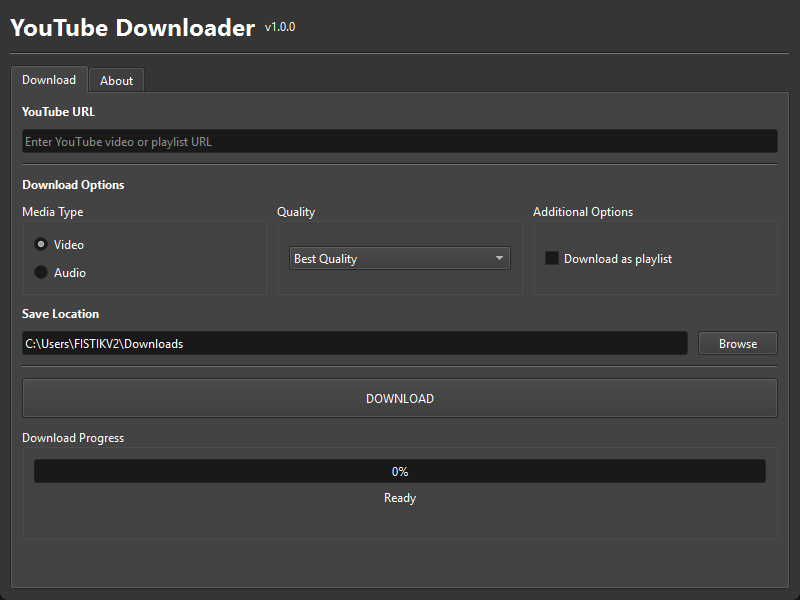

# YouTube Downloader

A user-friendly desktop application for downloading videos and audio from YouTube.



## Features

- Video and audio (MP3) download support
- Various video quality options (from 240p to 1080p)
- Different audio quality options (from 96kbps to 320kbps)
- Playlist download support
- Download progress tracking and status display
- Automatic thumbnail downloading
- Dark theme interface
- Custom download location selection

## Requirements

- Python 3.6 or higher
- FFmpeg
- The following Python packages:
  - PyQt6
  - yt-dlp
  - ffmpeg-python

## Installation

### 1. Clone the repository

```bash
git clone https://github.com/yourusername/ytdownloader.git
cd ytdownloader
```

### 2. Create a virtual environment (optional but recommended)

```bash
python -m venv venv
```

On Windows:

```bash
venv\Scripts\activate
```

On Linux/MacOS:

```bash
source venv/bin/activate
```

### 3. Install the requirements

```bash
pip install PyQt6 yt-dlp ffmpeg-python
```

### 4. Install FFmpeg

#### Windows

1. Download FFmpeg for Windows from the [FFmpeg download page](https://ffmpeg.org/download.html)
2. Extract the ZIP file and add the files from the `bin` folder to your system path or copy them into your application folder

#### Linux

```bash
sudo apt update
sudo apt install ffmpeg
```

#### macOS

```bash
brew install ffmpeg
```

## Usage

To start the application:

```bash
python src/main.py
```

1. Enter a YouTube video or playlist URL in the URL field
2. Select "Video" or "Audio" option
3. Choose your desired quality
4. Check "Download as playlist" option if needed (for playlists)
5. Change the save location if needed
6. Click the "DOWNLOAD" button
7. Track the download status from the progress bar

## Project Structure

```
ytdownloader/
├── src/                  # Source code
│   ├── main.py           # Main application entry
│   ├── __init__.py       # Package identifier
│   ├── core/             # Core functionality
│   │   ├── downloader.py # YouTube download operations
│   │   └── __init__.py   # Package identifier
│   └── ui/               # User interface
│       ├── main_window.py # Main window class
│       └── __init__.py    # Package identifier
├── assets/               # Images and icon files
└── README.md             # This file
```

## Technologies

- [PyQt6](https://www.riverbankcomputing.com/software/pyqt/) - User interface
- [yt-dlp](https://github.com/yt-dlp/yt-dlp) - YouTube download functionality
- [FFmpeg](https://ffmpeg.org/) - Video processing

## License

This project is licensed under the MIT License. See the [LICENSE](LICENSE) file for details.

## Contributing

1. Fork this repository
2. Create a new feature branch (`git checkout -b new-feature`)
3. Commit your changes (`git commit -am 'Add new feature'`)
4. Push your branch (`git push origin new-feature`)
5. Create a Pull Request

## Contact

For questions or suggestions, please contact [your email address].
